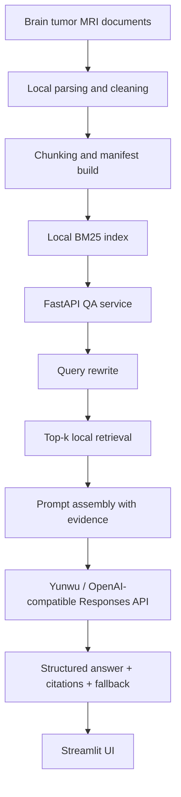

# Brain Tumor MRI Assistant

> A local RAG system for evidence-grounded brain tumor MRI Q&A, built with FastAPI, Streamlit, BM25 retrieval, and Yunwu/OpenAI-compatible Responses API.


一个面向脑肿瘤 MRI 场景的证据增强问答助手。当前版本聚焦于“文档入库 -> 本地检索 -> 大模型生成 -> 证据展示 -> 结构化输出”这一条主链路，适合作为医学影像 RAG、医学 AI 工程实践、以及本地知识库问答系统的学习和演示项目。

- 文档解析、切分、索引、检索全部在本地完成
- Yunwu 负责 query rewrite、回答生成和结构化输出
- 前端展示回答摘要、关键点、证据引用和检索片段

## Why This Project

很多医学 AI Demo 很容易停留在“纯聊天”层面，但真实可用的医学问答系统必须解决几个工程问题：

- 回答必须尽量绑定证据，而不是只靠模型记忆
- 文档来源需要可管理、可追踪、可复现
- 检索链路、提示词链路、结构化输出链路要能拆开调试
- 面对第三方兼容 API 时，架构需要有可迁移性和可降级能力

这个项目的价值，不只是“能回答问题”，更在于它把一个医学 RAG 系统拆成了清晰、可维护、可扩展的工程模块，便于继续演化到 embedding、hybrid retrieval、reranker、评测集、甚至更复杂的多阶段临床问答系统。

## Core Features

- 本地知识库构建：支持扫描本地文档目录，生成 manifest 和本地稀疏索引
- 本地 BM25 检索：不依赖托管 `vector_store`，便于深入理解 RAG 内部机制
- 多文档格式支持：当前重点支持 PDF、DOCX、Markdown、TXT 等文本型资料
- 文献采集工具：支持 PubMed + OpenAlex 的安全版候选检索与开放获取下载
- Structured Outputs：统一约束问答输出字段，便于前端展示和接口集成
- 会话管理：支持多轮问答与 `session_id` 级别的上下文持久化
- 降级策略：当兼容平台无法稳定返回严格 JSON 时，可回退到自由文本生成并包装成统一结构
- 可观测文件状态：`manifest.json`、`local_index.json`、`storage/sessions/*.json` 便于调试和复现

## System Architecture



## End-to-End Workflow

当用户在前端输入一个问题后，系统按下面的顺序工作：

1. Streamlit 前端将问题发送到 FastAPI 的 `/api/qa`
2. 后端读取 `session_id`，恢复多轮会话上下文
3. 问答服务对原始问题进行 query rewrite，生成更利于检索的中英检索式
4. 本地 BM25 检索从知识库中召回 top-k 片段
5. 系统把问题、检索片段、引用信息、会话上下文拼接成提示词
6. Yunwu/OpenAI-compatible Responses API 基于证据生成回答
7. 应用层校验结构化输出；若失败，则走自由文本降级包装
8. 前端展示摘要、关键点、证据引用、本地检索片段、局限性与建议追问

如果你希望完整理解每一步的数据结构、函数调用栈和实现细节，请直接阅读：

- [docs/LOCAL_RAG_TECHNICAL_GUIDE.md](docs/LOCAL_RAG_TECHNICAL_GUIDE.md)

## Demo

`demo/` 目录用于存放 README 展示截图和演示素材。

### Home / Query Page


### Result / Evidence View


这些截图展示了当前版本的两个核心使用场景：

- 用户输入脑肿瘤 MRI 相关问题后的主界面体验
- 回答摘要、关键点、证据引用与本地检索片段的结果展示


## Tech Stack

- Python 3.11
- FastAPI
- Streamlit
- Pydantic
- PyPDF / 文本解析
- 本地 BM25 检索
- Yunwu / OpenAI-compatible Responses API
- Pytest

## Repository Structure

```text
app/                      FastAPI 入口
frontend/                 Streamlit 前端
src/bmagent_rag/          核心业务逻辑
  local_rag.py            文档解析、切分、BM25 检索
  sync.py                 知识库同步与索引构建
  qa_service.py           问答编排主链路
  qa_api.py               问答接口
  literature.py           文献候选检索与 OA 下载
  provider_probe.py       OpenAI-compatible 能力探测
scripts/                  命令行脚本
tests/                    测试
docs/                     技术文档
demo/                     README 演示图片与素材
```

## Quick Start

### 1. Create Environment

```powershell
py -3.11 -m venv .venv
.venv\Scripts\Activate.ps1
py -3.11 -m pip install -e .[dev]
Copy-Item .env.example .env
```

### 2. Configure Environment Variables

最小配置示例：

```env
OPENAI_API_KEY=yourapi
OPENAI_BASE_URL=yoururl
OPENAI_MODEL=yourmodel
OPENAI_REASONING_EFFORT=medium
OPENAI_TEXT_VERBOSITY=low
OPENAI_MAX_OUTPUT_TOKENS=1400

BMAGENT_KB_SOURCE_DIR=data/knowledge_base/source
BMAGENT_KB_STATE_DIR=data/knowledge_base/state
BMAGENT_KB_NAME=brain-tumor-mri-kb-local
BMAGENT_KB_CHUNK_SIZE_CHARS=1400
BMAGENT_KB_CHUNK_OVERLAP_CHARS=250

BMAGENT_BACKEND_URL=http://127.0.0.1:8000
BMAGENT_CONTACT_EMAIL=
OPENALEX_MAILTO=
NCBI_API_KEY=
```

## Build the Local Knowledge Base

把教材、综述、核心论文放进：

```text
data/knowledge_base/source
```

然后运行：

```powershell
py -3.11 scripts\sync_knowledge_base.py --dry-run
py -3.11 scripts\sync_knowledge_base.py
```

执行完成后，关键产物会写入：

- `data/knowledge_base/state/manifest.json`
- `data/knowledge_base/state/local_index.json`

## Start the Application

启动后端：

```powershell
uvicorn app.main:app --reload
```

启动前端：

```powershell
streamlit run frontend/streamlit_app.py
```

## API Endpoints

- `GET /api/healthz`
- `POST /api/sessions`
- `GET /api/sessions/{session_id}`
- `GET /api/kb/status`
- `POST /api/kb/sync`
- `POST /api/qa`

## Literature Collection Workflow

项目内置了一个“安全版文献采集”流程：

- 先从 PubMed 拉候选文献元数据
- 再用 OpenAlex 补充开放获取状态
- 只在用户显式开启下载时下载 OA PDF
- 不抓付费墙，不依赖反爬，不绕过版权限制

示例：

```powershell
py -3.11 scripts\search_literature_candidates.py "glioblastoma MRI review" --max-results 20 --from-year 2020 --reviews-only
```

下载开放获取 PDF：

```powershell
py -3.11 scripts\search_literature_candidates.py "glioblastoma MRI review" --max-results 20 --from-year 2020 --reviews-only --download-open-access
```

## Provider Compatibility

项目提供了一个平台能力探针，用来测试兼容服务是否真的支持完整 OpenAI 风格能力：

```powershell
py -3.11 scripts\probe_provider_compat.py --base-url "https://yunwu.ai/v1" --model "gpt-4.1"
```

它会按顺序检测：

- `Responses API`
- `Files API`
- `vector_store`
- `file_search`


## Validation

```powershell
py -3.11 -m pytest
py -3.11 -m compileall app frontend scripts src tests
```


## Current Limitations

- 当前默认检索是本地 BM25，不是 embedding 向量检索
- PDF 文本抽取质量受源文件质量影响较大
- 第三方 OpenAI-compatible 平台对严格结构化输出的兼容性不完全一致
- 回答质量依赖知识库覆盖范围和文档质量

## Roadmap

- 接入 embedding 检索与 hybrid retrieval
- 增加 reranker 提升召回排序质量
- 增加 OCR 流程支持扫描版 PDF
- 引入标准评测集与自动评估脚本
- 增加更细粒度的结构化日志与 tracing
- 支持更强的引用定位与证据可视化

## Safety Notice

本项目仅用于医学影像信息整理、文献证据辅助和工程研究演示，不构成医学诊断、治疗建议或临床决策依据。

任何与患者诊疗相关的判断，都应由放射科医师、神经肿瘤团队、病理结果和正式临床流程共同决定。

