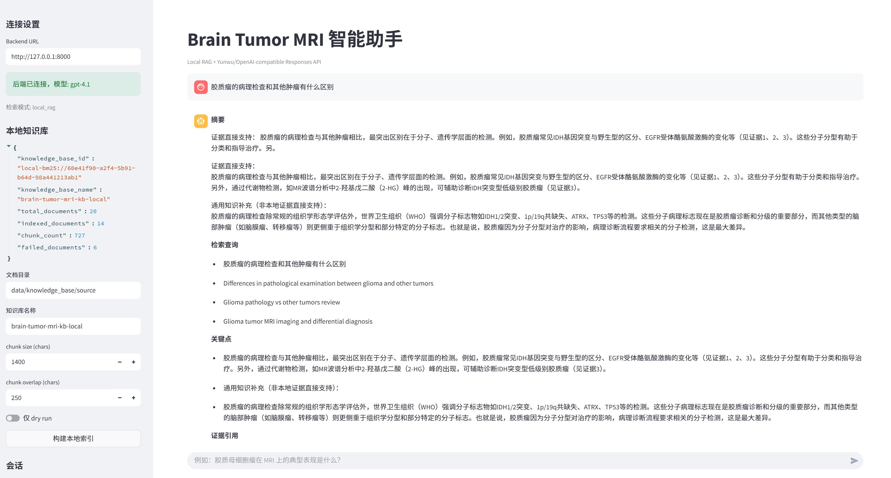
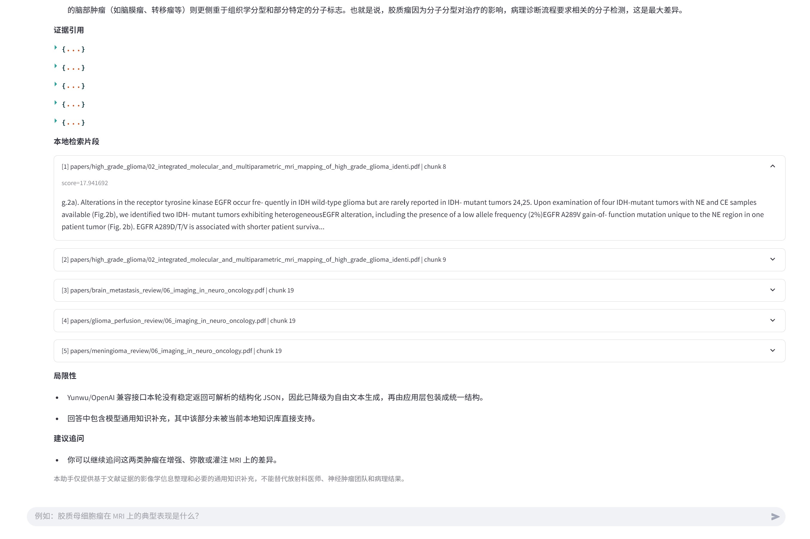

# Brain Tumor MRI Assistant

> A local RAG application for brain tumor MRI question answering with evidence retrieval, structured answers, and a lightweight demo UI.


## Overview

This project focuses on one narrow but practical workflow:

1. ingest brain tumor MRI literature into a local knowledge base,
2. retrieve relevant evidence with local BM25 search,
3. call a Responses API compatible model to generate an answer,
4. return structured output with evidence snippets.

The current implementation is designed for learning, prototyping, and demo scenarios. It keeps retrieval local and treats the model provider as the generation layer only.

## Features

- Local knowledge base sync from PDF, DOCX, Markdown, TXT, and other text-friendly sources
- Local BM25 retrieval for transparent, debuggable RAG behavior
- FastAPI backend for sessions, knowledge-base status, sync, and QA endpoints
- Streamlit frontend for interactive demo and evidence display
- Compatible with Yunwu / OpenAI-style Responses API providers
- Structured-answer fallback strategy when strict JSON output is unstable

## Demo





## Tech Stack

- Python 3.11
- FastAPI
- Streamlit
- Pydantic
- Local BM25 retrieval
- Pytest

## Project Structure

```text
app/                      FastAPI entrypoint
frontend/                 Streamlit UI
src/bmagent_rag/          core RAG logic
scripts/                  utility scripts
tests/                    automated tests
docs/                     project documentation
demo/                     screenshots and demo assets
```

## Quick Start

```powershell
py -3.11 -m venv .venv
.venv\Scripts\Activate.ps1
py -3.11 -m pip install -e .[dev]
Copy-Item .env.example .env
```

Set your provider variables in `.env`, then build the local knowledge base:

```powershell
py -3.11 scripts\sync_knowledge_base.py
```

Start the backend:

```powershell
uvicorn app.main:app --reload
```

Start the frontend:

```powershell
streamlit run frontend/streamlit_app.py
```

## Useful Scripts

Probe provider compatibility:

```powershell
py -3.11 scripts\probe_provider_compat.py --base-url "https://yunwu.ai/v1" --model "gpt-4.1"
```

Search literature candidates:

```powershell
py -3.11 scripts\search_literature_candidates.py "glioblastoma MRI review" --max-results 20 --from-year 2020 --reviews-only
```

## Documentation

Detailed technical notes are available in [docs/LOCAL_RAG_TECHNICAL_GUIDE.md](docs/LOCAL_RAG_TECHNICAL_GUIDE.md).

## Safety Notice

This repository is for research, engineering, and educational use only. It does not provide medical diagnosis or treatment advice.
