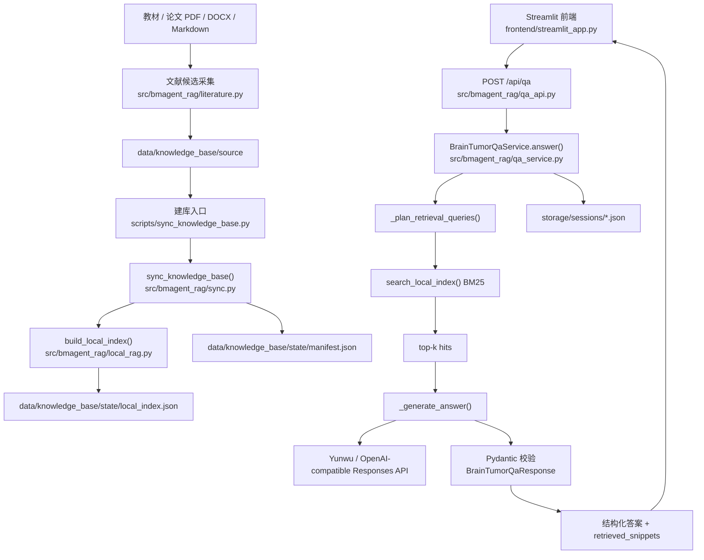

# Brain Tumor MRI Assistant 本地 RAG 技术说明（源码绑定版）

## 1. 文档目标

这份文档不是产品介绍，也不是只讲概念的 RAG 科普，而是面向“第一次接手项目的工程师、面试官问答准备、导师答辩准备”的源码绑定文档。

读完这份文档，你应该能够回答下面这些问题：

- 这个项目为什么从托管 `file_search` 改成了本地 RAG。
- 文献是怎么找到、筛选、下载、落盘的。
- PDF / DOCX / HTML 是怎么被读成纯文本的。
- 文本为什么按 `1400` 字符、`250` 字符 overlap 来切分。
- 为什么当前版本用的是 BM25，而不是 embedding 向量检索。
- 用户提问以后，数据如何从前端一路流到 FastAPI、检索器、模型，再流回前端。
- top-k 是怎么计算出来的，排序依据是什么。
- 结构化输出失败时，系统为什么还能给出“可解释的兜底回答”。
- 如果要做下一版优化，应该改哪里、怎么改、改完会影响哪些模块。

一句话概括当前架构：

`本地文档解析 + 本地 BM25 检索 + Yunwu/OpenAI-compatible Responses 生成 + Pydantic 结构化响应约束`

---

## 2. 为什么是“本地 RAG + Yunwu 生成”

### 2.1 背景

项目最初设计是典型的 OpenAI 托管 RAG：

1. 上传文件到 `Files API`
2. 建 `vector_store`
3. 通过 `file_search` 自动检索
4. 再让模型基于检索结果生成结构化答案

但你实际使用的是 `yunwu.ai` 的 OpenAI-compatible 网关。通过探针脚本验证后，已经确认：

- 基础 `Responses API` 文本生成可用
- `function calling` 基本可用
- `Files API / vector_store / file_search` 不可稳定依赖

所以项目转成了更可控的路线：

- 检索在本地完成
- 模型只负责两件事：`query rewrite` 和 `最终答案生成`
- 所有知识库状态、索引和会话上下文都由我们自己落盘维护

### 2.2 这意味着什么

这套方案的优点：

- 不依赖第三方平台是否完整支持托管 RAG 能力
- 检索链路完全透明，便于调试和学习
- 任何一步出错都能直接定位到源码和本地文件
- 对“深入理解 RAG 工程实现”非常友好

这套方案的代价：

- 需要自己处理文档解析、切分、索引和召回
- 当前没有 embedding，召回上限受 BM25 限制
- PDF 噪声清洗需要自己做，不像托管方案那样封装在平台里

---

## 3. 总体架构



### 3.1 模块职责总览

- `src/bmagent_rag/literature.py`
  - 负责文献候选检索、OpenAlex 补充、开放获取 PDF 下载。
- `src/bmagent_rag/config.py`
  - 负责建库侧配置装配，如文档目录、状态目录、chunk 参数。
- `src/bmagent_rag/qa_config.py`
  - 负责问答侧模型配置装配，如 API Key、Base URL、模型名、输出控制参数。
- `src/bmagent_rag/manifest.py`
  - 负责知识库元数据落盘，记录每个文件的解析与索引状态。
- `src/bmagent_rag/local_rag.py`
  - 负责文本提取、chunk 切分、分词、BM25 索引构建和查询。
- `src/bmagent_rag/sync.py`
  - 负责把源文档目录同步成 `manifest.json + local_index.json`。
- `src/bmagent_rag/qa_models.py`
  - 负责 API 请求、结构化响应、证据引用、多轮会话等 Pydantic 模型定义。
- `src/bmagent_rag/qa_prompts.py`
  - 负责 query rewrite prompt 和回答 system prompt。
- `src/bmagent_rag/qa_service.py`
  - 负责问答编排主流程，是整个项目最关键的服务层。
- `src/bmagent_rag/qa_api.py`
  - 负责 FastAPI 路由暴露，把 HTTP 请求转给 service 层。
- `frontend/streamlit_app.py`
  - 负责交互式演示页面，展示知识库状态、问答结果和证据片段。

---

## 4. 代码地图：先读哪些文件

如果你要快速接手项目，我建议按下面顺序阅读源码：

1. `src/bmagent_rag/qa_api.py`
   - 先看有哪些 API，以及每个 API 把工作交给了谁。
2. `src/bmagent_rag/qa_service.py`
   - 这是“用户提问 -> 检索 -> 生成 -> 返回”的主控制器。
3. `src/bmagent_rag/local_rag.py`
   - 这是“文档如何变成索引、问题如何变成 top-k 证据”的核心。
4. `src/bmagent_rag/sync.py`
   - 这是“建库和索引落盘”的入口。
5. `src/bmagent_rag/qa_models.py`
   - 看结构化输出到底长什么样。
6. `src/bmagent_rag/literature.py`
   - 看候选文献是怎么被自动搜索和下载的。
7. `frontend/streamlit_app.py`
   - 看前端如何调用 API、展示证据和会话。

---

## 5. 文献采集工作流：从关键词到 PDF

### 5.1 入口脚本与核心函数

命令行入口：

```powershell
py -3.11 scripts\search_literature_candidates.py "glioblastoma MRI review" --max-results 20 --from-year 2020 --reviews-only --download-open-access
```

脚本内部实际调用：

- CLI 入口：`scripts/search_literature_candidates.py`
- 参数解析：`src/bmagent_rag/literature.py -> build_parser()`
- 配置装配：`src/bmagent_rag/literature.py -> build_config_from_args()`
- 主流程：`src/bmagent_rag/literature.py -> collect_literature_candidates()`

### 5.2 采集流程分解

`collect_literature_candidates()` 的执行顺序是固定的：

1. `search_pubmed_pmids(config)`
   - 调 PubMed `esearch`，拿到 PMID 列表。
2. `fetch_pubmed_summaries(pmids, config)`
   - 调 PubMed `esummary`，拿到题目、期刊、作者、发表时间、DOI 等摘要元数据。
3. `normalize_pubmed_candidate(summary, rank, source_query)`
   - 把 PubMed 返回统一整理成 `LiteratureCandidate`。
4. `enrich_with_openalex(candidate, config)`
   - 用 DOI 或 PubMed URL 调 OpenAlex，补充开放获取状态、PDF 链接和引用次数。
5. `maybe_download_open_access_pdfs(candidates, config)`
   - 如果命令里显式传了 `--download-open-access`，则下载有明确 `oa_pdf_url` 的 PDF。
6. `export_candidates(candidates, output_dir, query)`
   - 无论是否下载 PDF，都会导出 CSV 和 JSON 候选清单。

### 5.3 为什么是 PubMed + OpenAlex

这是一个非常典型的“安全版自动化”组合：

- PubMed 负责高质量生物医学文献检索
- OpenAlex 负责开放获取补充信息

原因是：

- PubMed 的主题检索质量对医学领域足够稳定
- OpenAlex 对 `is_oa / pdf_url / landing_page_url / cited_by_count` 这类补充字段很方便
- 这套组合不会直接去抓出版社付费墙页面，合规风险更低

### 5.4 采集结果落盘到哪里

- 候选清单 CSV / JSON：`data/literature_candidates/*.csv|json`
- 下载的开放获取 PDF：`data/knowledge_base/source/papers/*`

这些 PDF 并不会自动变成可检索知识库，必须再走下一步建库流程。
---

## 6. 建库工作流：从原始文件到 `local_index.json`

### 6.1 入口脚本与主函数

命令行入口：

```powershell
py -3.11 scripts\sync_knowledge_base.py
```

API 入口：

```http
POST /api/kb/sync
```

两条入口最后都会落到同一个核心函数：

- `src/bmagent_rag/sync.py -> sync_knowledge_base(config)`

### 6.2 `sync_knowledge_base()` 的精确执行顺序

`sync_knowledge_base()` 是整个建库链路的编排器，执行顺序如下：

1. 创建目录
   - `config.source_dir.mkdir(...)`
   - `config.state_dir.mkdir(...)`
2. 读取或创建 manifest
   - `KnowledgeBaseManifest.load(config.manifest_path)`
3. 扫描源目录
   - `scan_documents(config.source_dir, config.allowed_extensions)`
4. 统计增量变化
   - 对比 `manifest.documents[relative_path].sha256`
   - 计算 `skipped_files` 和 `new_or_changed_files`
5. 确定 `knowledge_base_id`
   - `ensure_knowledge_base_id(manifest, config)`
6. 如果是 `dry_run`
   - 直接返回统计，不真正解析文件、不写索引
7. 真正建索引
   - `build_local_index(...)`
8. 索引落盘
   - `save_local_index(index, config.index_path)`
9. 回写 manifest
   - `_build_manifest_records(...)`
   - `manifest.save(config.manifest_path)`
10. 返回 `SyncSummary`

### 6.3 为什么要有 `manifest.json`

当前项目里有两个关键状态文件：

- `data/knowledge_base/state/local_index.json`
  - 这是检索数据面（data plane）
  - 真正存储 chunk、词频、文档频率、平均 chunk 长度
- `data/knowledge_base/state/manifest.json`
  - 这是控制面（control plane）
  - 存储文件级状态、最近同步时间、解析器类型、chunk 数等元数据

你可以把它们理解为：

- `local_index.json` 负责“检索能不能工作”
- `manifest.json` 负责“工程状态是否可观察”

### 6.4 `scan_documents()` 做了什么

`src/bmagent_rag/sync.py -> scan_documents()` 的输入是源目录，输出是 `list[LocalDocument]`。

每个 `LocalDocument` 包含：

- `absolute_path`
- `relative_path`
- `size_bytes`
- `sha256`
- `mime_type`

这里最关键的两个字段是：

- `relative_path`
  - 用作 manifest 和索引里的稳定文档键
- `sha256`
  - 用作文件内容变更检测

### 6.5 为什么要算 SHA256

SHA256 的作用不是“安全校验”，而是“工程去重和变更检测”。

具体逻辑：

- 如果同一路径文件的 `sha256` 与 manifest 里记录的值相同，说明文件内容没有变化
- 这类文件会被计入 `skipped_files`
- 如果 `sha256` 发生变化，就会被视为“新文件或内容变更文件”

虽然当前实现依旧会整体重建索引，但 `skipped_files` 和 `new_or_changed_files` 让你能快速知道：

- 这次建库是不是白跑了一次
- 最近加入了哪些新资料
- 当前索引规模增长来自哪里

---

## 7. 文档解析：PDF / DOCX / HTML / 文本 是怎么读出来的

### 7.1 统一入口：`read_text_from_path()`

具体实现位置：

- `src/bmagent_rag/local_rag.py -> read_text_from_path(path)`

它会根据扩展名分发到不同解析器：

- `.txt/.md/.csv/.json` -> `_read_text_file()`
- `.html/.htm` -> `_read_text_file()` + 标签清洗
- `.pdf` -> `_extract_pdf_text()`
- `.docx` -> `_extract_docx_text()`
- 其他类型 -> `_read_text_file()` 兜底

### 7.2 文本文件读取策略

`_read_text_file()` 会按多种编码顺序尝试：

- `utf-8-sig`
- `utf-8`
- `gb18030`
- `cp936`
- `latin-1`

这样做的理由是：

- 医学资料来源很杂，不一定都是标准 UTF-8
- 中文资料里常见 GBK / GB18030
- 有些历史导出文件会自带 BOM

### 7.3 HTML 处理策略

HTML 的处理并不复杂，核心目标只有一个：

`把带标签的页面文本变成可检索纯文本`

处理步骤：

1. 读取原始文本
2. 去掉 `<script>...</script>`
3. 去掉 `<style>...</style>`
4. 去掉普通 HTML 标签
5. 走 `normalize_text()` 清洗空白

### 7.4 PDF 处理策略

PDF 的处理函数是：

- `src/bmagent_rag/local_rag.py -> _extract_pdf_text(path)`

执行逻辑：

1. 尝试 `from pypdf import PdfReader`
2. `reader = PdfReader(str(path))`
3. 遍历 `reader.pages`
4. 对每页执行 `page.extract_text()`
5. 把所有页的文本用 `\n\n` 拼起来
6. 最后走 `normalize_text()`

### 7.5 为什么 PDF 会有噪声

这是当前项目最真实、最重要的已知问题之一。

如果 `pypdf` 提取失败，或者 PDF 本身文本层质量很差，系统会走：

- `_binary_fallback_text(path)`

这个兜底逻辑会：

- 直接读取字节
- 尝试按 `utf-8` 容错解码
- 把可解码字符当成文本

这会带来一个典型副作用：

- `%PDF-1.4`
- XMP metadata
- Publisher 信息
- 压缩流中的零散字符串

都有可能混进索引。

这也是为什么你之前看到检索结果里会出现 PDF 头和元数据噪声。

### 7.6 DOCX 处理策略

DOCX 的处理函数是：

- `src/bmagent_rag/local_rag.py -> _extract_docx_text(path)`

处理方式：

1. 尝试 `from docx import Document`
2. `document = Document(str(path))`
3. 遍历 `document.paragraphs`
4. 取非空 `paragraph.text`
5. 用 `\n\n` 拼接
6. 最后 `normalize_text()`

---

## 8. 文本清洗、切分、分词：为什么这样做

### 8.1 `normalize_text()` 做了什么

实现位置：

- `src/bmagent_rag/local_rag.py -> normalize_text(text)`

做了 4 件事：

1. 统一换行符 `\r\n / \r -> \n`
2. `html.unescape()` 处理 HTML 实体
3. 把连续空格压成单空格
4. 把过多空行压成最多双空行

这一步的目标不是“做 NLP 预处理”，而是“减少明显脏数据，保证后续切分稳定”。

### 8.2 为什么按字符切 chunk，而不是按语义切分

当前项目使用的是：

- `chunk_size_chars = 1400`
- `chunk_overlap_chars = 250`

来自配置：

- `src/bmagent_rag/config.py -> build_config()`
- manifest 中也会记录这两个值

当前没有采用基于段落、标题、语义边界的切分，原因是：

1. 第一版目标是先跑通完整链路
2. 字符窗口切分实现简单、稳定、可复现
3. 调试时更容易理解“为什么这个 chunk 命中了”
4. 对 BM25 这种稀疏检索来说，稳定窗口比复杂切分更容易建立基线

### 8.3 `1400 / 250` 的工程含义

这个参数不是医学专用参数，而是工程折中：

- `1400` 字符
  - 足够覆盖一段较完整的论文正文或教材片段
  - 不至于太短，避免上下文过碎
  - 也不至于太长，避免 prompt 拼接时上下文爆炸
- `250` overlap
  - 用来减少“关键信息刚好被切在边界处”的问题
  - 保留一定连续上下文

### 8.4 分词规则是什么

实现位置：

- `src/bmagent_rag/local_rag.py -> tokenize(text)`

正则：

```python
TOKEN_PATTERN = re.compile(r"[A-Za-z0-9]+|[\u4e00-\u9fff]")
```

这意味着：

- 英文和数字按连续串分词
- 中文按单字分词

这不是最强中文分词方案，但它足够简单、可控，而且和 BM25 的第一版 baseline 比较匹配。

### 8.5 `split_into_chunks()` 的真实逻辑

伪代码等价于：

```python
normalized = normalize_text(text)
step = chunk_size - overlap
while start < len(normalized):
    chunk = normalized[start:start + chunk_size]
    start += step
```

注意点：

- 如果 `overlap >= chunk_size`，代码会自动修正，避免死循环
- 如果整篇文本长度小于 `chunk_size`，则整篇直接作为一个 chunk

---

## 9. `local_index.json` 里到底存了什么

### 9.1 索引对象结构

`build_local_index()` 返回的是 `LocalKnowledgeBaseIndex`，其中最重要的字段有：

- `knowledge_base_id`
- `document_summaries`
- `chunks`
- `document_frequency`
- `average_chunk_length`
- `total_chunk_count`
- `total_token_count`

### 9.2 单个 chunk 包含哪些字段

每个 `LocalChunk` 包含：

- `chunk_id`
- `document_relative_path`
- `document_sha256`
- `chunk_index`
- `text`
- `token_count`
- `character_count`
- `term_frequencies`

其中最重要的是：

- `text`
  - 后续直接作为检索命中片段和 prompt 上下文来源
- `term_frequencies`
  - BM25 打分核心输入
- `token_count`
  - BM25 长度归一化核心输入

### 9.3 为什么还要统计 `document_frequency`

BM25 不是简单的关键词计数，它还需要知道：

`一个词在多少个 chunk 中出现过`

所以在 `build_local_index()` 里，对每个 chunk 都会执行：

- `term_frequencies = Counter(tokens)`
- `document_frequency.update(set(tokens))`

注意这里用的是 `set(tokens)`，不是原始 token 列表。

原因是：

- BM25 的 `df` 统计的是“出现于多少篇文档/多少个 chunk”
- 不是“总共出现了多少次”

这就是为什么这里必须先去重。
---

## 10. 问答主流程：从用户问题到结构化答案

### 10.1 前端入口

Streamlit 页面在：

- `frontend/streamlit_app.py`

用户输入问题后，前端会构造：

```json
{
  "session_id": "...",
  "question": "胶质母细胞瘤在 MRI 上的典型表现是什么？",
  "use_query_rewrite": true,
  "knowledge_base_id": "..."
}
```

然后通过：

- `post_json(base_url, '/api/qa', payload)`

发送给后端。

### 10.2 FastAPI 路由层

后端入口在：

- `src/bmagent_rag/qa_api.py -> qa(request)`

它本身非常薄，只做一件事：

- 调用 `qa_service.answer(request)`

这是一种典型的分层设计：

- `qa_api.py` 只负责 HTTP
- `qa_service.py` 负责业务流程

### 10.3 `BrainTumorQaService.answer()` 是整个系统的中枢

主函数：

- `src/bmagent_rag/qa_service.py -> BrainTumorQaService.answer()`

它的执行顺序如下：

1. `build_config()`
   - 读取当前知识库路径和 chunk 参数配置
2. `KnowledgeBaseManifest.load(...)`
   - 读取 manifest，确认当前知识库状态
3. 检查 `local_index.json` 是否存在
   - 不存在直接报错：先执行 `/api/kb/sync`
4. 检查 `request.knowledge_base_id`
   - 如果用户指定的知识库 ID 与当前 manifest 不一致，则返回 404
5. `load_local_index(sync_config.index_path)`
   - 读取本地检索索引
6. `session_store.get_or_create(session_id=...)`
   - 获取或创建会话
7. `effective_previous_response_id = request.previous_response_id or session.previous_response_id`
   - 兼容多轮生成上下文
8. `_plan_retrieval_queries()`
   - 生成检索词
9. `search_local_index(index, combined_query, top_k=request.max_num_results)`
   - 执行 BM25 检索
10. `_hits_to_snippets(hits)`
   - 生成前端展示片段
11. 如果 `hits` 为空
   - 返回 `_build_insufficient_answer()`
12. 如果 `hits` 非空
   - 进入 `_generate_answer()`
13. 若模型没有返回 evidence
   - 使用 `_hits_to_evidence()` 兜底
14. `record_turn(...)`
   - 把本轮会话落盘
15. 返回 `BrainTumorQaEnvelope`

### 10.4 Query Rewrite 是怎么做的

函数位置：

- `src/bmagent_rag/qa_service.py -> _plan_retrieval_queries()`

逻辑：

- 如果 `use_query_rewrite=False`，直接返回 `[question]`
- 如果没有可用模型客户端，也直接返回 `[question]`
- 否则调用：
  - `client.responses.create(model=..., input=build_query_rewrite_prompt(question))`
- 期望模型返回一个 JSON：

```json
{"queries": ["query1", "query2", "query3"]}
```

然后：

- 取 `payload['queries']`
- 去空白
- 与原始问题合并去重
- 最多保留 4 条

### 10.5 为什么要“原问题 + 改写查询”合并检索

当前代码不是只用 rewrite 后的查询，而是：

```python
combined_query = ' '.join(dict.fromkeys([request.question, *retrieval_queries]))
```

这样做的好处：

- 保留用户原始表达，不丢原始意图
- 同时加入模型扩展出来的专业关键词
- 对 BM25 来说，关键词越覆盖目标文档的实际表述，召回越稳

这是一种“低风险 query expansion”策略。

---

## 11. BM25 检索：top-k 到底是怎么算出来的

### 11.1 函数入口

检索函数在：

- `src/bmagent_rag/local_rag.py -> search_local_index(index, query, top_k=5)`

输入：

- `index: LocalKnowledgeBaseIndex`
- `query: str`
- `top_k: int`

输出：

- `list[SearchHit]`

### 11.2 查询预处理

第一步：

```python
query_tokens = tokenize(normalize_text(query))
```

这一步非常重要，因为它保证：

- 建库阶段和查询阶段使用同一套文本标准化规则
- 不会出现“入库和检索口径不一致”导致的命中下降

### 11.3 BM25 公式在代码里怎么体现

核心代码：

```python
idf = math.log(1.0 + ((total_chunks - df + 0.5) / (df + 0.5)))
numerator = tf * 2.2
denominator = tf + 1.2 * (1 - 0.75 + 0.75 * (chunk.token_count / avgdl))
score += idf * numerator / denominator * qtf
```

它对应的是 BM25 的标准形式：

```text
score(q, d) = Σ idf(t) * ((tf * (k1 + 1)) / (tf + k1 * (1 - b + b * dl / avgdl))) * qtf
```

在本项目里：

- `k1 = 1.2`
- `b = 0.75`
- 所以 `k1 + 1 = 2.2`

### 11.4 各个变量分别代表什么

- `tf`
  - 某个词在当前 chunk 中出现的次数
- `df`
  - 某个词在多少个 chunk 中出现过
- `idf`
  - 稀有词权重；越稀有、越能区分文档，权重越高
- `chunk.token_count`
  - 当前 chunk 长度
- `avgdl`
  - 所有 chunk 的平均长度
- `qtf`
  - 某个词在用户查询里出现的次数

### 11.5 为什么 BM25 合理

当前第一版选 BM25，而不是 embedding，原因有 4 个：

1. 代码量小，容易讲清楚
2. 检索结果可解释性强
3. 不依赖额外 embedding 服务
4. 很适合作为本地 RAG 的 baseline

如果面试官问“为什么不一开始就上向量检索”，一个很专业的回答是：

> 第一版的目标是把 RAG 主链路工程化跑通，并建立可解释基线。BM25 虽然不具备语义召回能力，但它透明、稳定、便于调试，很适合作为检索基准。等 baseline 稳定后，再增加 embedding 或 reranker，能更清楚地衡量优化收益。

### 11.6 top-k 是怎么取的

`search_local_index()` 在完成所有 chunk 打分后，会：

```python
scores.sort(key=lambda item: item[0], reverse=True)
return [... for score, chunk in scores[:top_k]]
```

也就是说：

- 先对所有 chunk 计算 BM25 score
- 按分数降序排序
- 再切片取前 `top_k`

### 11.7 `top_k` 的默认值与边界

来源：

- `src/bmagent_rag/qa_models.py -> BrainTumorQaRequest.max_num_results`

定义：

- 默认值：`5`
- 最小值：`1`
- 最大值：`20`

这意味着前端或 API 可以调大召回数，但当前系统不允许无限放大上下文。

---

## 12. 生成层：模型如何被约束成结构化输出

### 12.1 生成主函数

位置：

- `src/bmagent_rag/qa_service.py -> _generate_answer(question, hits, previous_response_id)`

它做了三层控制：

1. prompt 里只放 top-k 检索证据
2. 优先走严格 `json_schema`
3. 如果严格失败，再走 `JSON-only` fallback

### 12.2 Prompt 是怎么组织的

当前 prompt 形态非常明确：

```text
用户问题:
{question}

本地检索证据:
{top-k hits 拼接块}

请基于以上证据作答，并严格输出 JSON。
```

其中 `{top-k hits 拼接块}` 来自：

- `src/bmagent_rag/qa_service.py -> _build_context_block(hits)`

它会把每个命中组织成：

```text
[1] file=xxx chunk=xxx score=xxx
命中的 snippet 文本
```

### 12.3 System Prompt 在哪里

定义在：

- `src/bmagent_rag/qa_prompts.py -> build_answer_system_prompt()`

这个 prompt 的职责不是回答问题，而是限制模型行为，例如：

- 只能依据证据回答
- 不要给出超出证据的医学断言
- 必须输出 JSON
- 必须包含 evidence / limitations / safety_note 等字段

### 12.4 严格结构化输出怎么做

第一次尝试会传：

```python
text={
  'verbosity': self.config.openai_text_verbosity,
  'format': {
    'type': 'json_schema',
    'name': 'brain_tumor_mri_qa_response',
    'strict': True,
    'schema': BrainTumorQaResponse.model_json_schema(),
  },
}
```

关键点：

- `schema` 直接来自 `BrainTumorQaResponse.model_json_schema()`
- 也就是说，最终结构定义权在 `qa_models.py`
- 模型输出必须满足这个 schema，后续才可能直接被 Pydantic 校验通过

### 12.5 为什么还要有第二轮 fallback

现实中，第三方兼容网关不一定稳定支持严格 schema 输出。

所以 `_generate_answer()` 的策略是：

第一轮：
- 严格 `json_schema`
- 期望 `raw_text` 可以直接 `BrainTumorQaResponse.model_validate_json(raw_text)`

第二轮：
- 放弃严格 schema
- 只要求“你必须只输出一个 JSON 对象”
- 再从文本里抽出第一个 JSON 对象解析

第三轮：
- 如果前两轮都失败
- 返回 `_build_retrieval_only_answer()`

### 12.6 为什么兜底回答仍然有价值

兜底回答不是“失败结果”，而是一个很重要的工程韧性设计。

当模型输出不稳定时，系统仍然能：

- 返回 top-k 命中文档名
- 返回 evidence
- 告诉用户这是“检索兜底结果”
- 明确 limitations

这意味着系统不会因为结构化输出失败而完全不可用。

---

## 13. 结构化数据模型：前后端到底交换什么

### 13.1 请求模型

用户提问的请求模型是：

- `src/bmagent_rag/qa_models.py -> BrainTumorQaRequest`

关键字段：

- `session_id`
- `question`
- `previous_response_id`
- `knowledge_base_id`
- `max_num_results`
- `use_query_rewrite`

### 13.2 答案模型

模型被要求输出的是：

- `src/bmagent_rag/qa_models.py -> BrainTumorQaResponse`

最关键字段包括：

- `answer_type`
- `confidence`
- `answer_summary`
- `answer_detail`
- `key_points`
- `imaging_features`
- `differential_diagnosis`
- `sequence_meaning`
- `evidence`
- `limitations`
- `follow_up_questions`
- `safety_note`

### 13.3 API 最终返回的外层 envelope

最终接口返回的是：

- `BrainTumorQaEnvelope`

它比单纯答案多出来几类工程信息：

- `session`
- `response_id`
- `previous_response_id`
- `knowledge_base_id`
- `retrieval_queries`
- `retrieved_snippets`

这意味着前端既能展示答案，也能展示：

- 实际检索词是什么
- 命中了哪些 snippet
- 当前会话的状态如何

---

## 14. 多轮会话：上下文是怎么保存的

### 14.1 会话存储位置

会话落盘目录：

- `storage/sessions/*.json`

实现类：

- `src/bmagent_rag/qa_service.py -> QaSessionStore`

### 14.2 每轮保存什么

每轮问答会被记录为 `QaTurnRecord`，主要字段：

- `turn_index`
- `question`
- `response_id`
- `previous_response_id`
- `answer_summary`
- `answer_type`
- `retrieval_queries`
- `created_at`

### 14.3 为什么要保存 `previous_response_id`

原因是：

- 如果上游网关兼容 `previous_response_id`
- 后续轮次可以尝试复用前序响应上下文

即使兼容性一般，保留这个字段依然有价值，因为它让系统具备多轮扩展空间。
---

## 15. 一次真实请求的端到端调用栈

这一节不再只讲“概念流程”，而是按实际函数调用顺序，把一次问题从前端走到后端、再回到前端的路径完整展开。

### 15.1 示例问题

假设用户在 Streamlit 页面输入：

```text
胶质母细胞瘤在 MRI 上的典型表现是什么？
```

前端会构造一个 `BrainTumorQaRequest` 风格的 JSON，请求体通常接近：

```json
{
  "session_id": "3d6b2c3f-9d84-4a55-9b8f-2b0d5d7c8f41",
  "question": "胶质母细胞瘤在 MRI 上的典型表现是什么？",
  "previous_response_id": null,
  "knowledge_base_id": "brain-tumor-mri-kb-local-...",
  "max_num_results": 5,
  "use_query_rewrite": true
}
```

这个对象最终会发到：

- FastAPI 路由：`src/bmagent_rag/qa_api.py:70 -> qa()`
- 业务核心：`src/bmagent_rag/qa_service.py:140 -> BrainTumorQaService.answer()`

### 15.2 逐步调用顺序

可以把调用栈理解为下面这条固定链路：

1. `frontend/streamlit_app.py`
   - 收集用户输入、当前会话 ID、知识库 ID。
   - 通过 `post_json()` 把请求发到 `/api/qa`。
2. `src/bmagent_rag/qa_api.py:70 -> qa()`
   - 不做复杂逻辑，只把 Pydantic 校验后的请求转交给 service 层。
3. `src/bmagent_rag/qa_service.py:140 -> answer()`
   - 这是问答主编排器。
4. `answer()` 内部读取本地状态
   - `build_config()` 读取建库配置。
   - `KnowledgeBaseManifest.load(...)` 读取 `manifest.json`。
   - `load_local_index(...)` 读取 `local_index.json`。
5. `answer()` 处理会话
   - `session_store.get_or_create(...)` 获取或新建会话。
   - 解析 `previous_response_id`，准备多轮上下文。
6. `answer()` 规划检索词
   - `src/bmagent_rag/qa_service.py:206 -> _plan_retrieval_queries()`
7. `answer()` 执行检索
   - `src/bmagent_rag/local_rag.py:335 -> search_local_index()`
8. `answer()` 处理检索结果
   - `src/bmagent_rag/qa_service.py:353 -> _hits_to_snippets()`
   - 如果没有 hit，直接走 `_build_insufficient_answer()`
9. `answer()` 调模型生成
   - `src/bmagent_rag/qa_service.py:230 -> _generate_answer()`
10. `answer()` 兜底证据与会话落盘
   - `_hits_to_evidence()`
   - `session_store.record_turn(...)`
11. 返回 `BrainTumorQaEnvelope`
   - 经 FastAPI 返回给前端。
12. `frontend/streamlit_app.py`
   - 渲染答案摘要、详细解释、证据列表、检索片段。

### 15.3 `answer()` 内部的关键控制分支

`BrainTumorQaService.answer()` 有 4 个非常关键的分支点：

#### 分支 A：知识库是否已同步

如果 `local_index.json` 不存在，`answer()` 不会尝试回答，而是直接提示先执行建库。

这保证了系统不会在“没有索引”的情况下产生看似合理但实际无证据的回答。

#### 分支 B：请求中的 `knowledge_base_id` 是否匹配

如果前端传来的知识库 ID 和当前 `manifest.json` 中记录的不一致，会返回 404。

这样设计的原因是：

- 避免前端缓存了旧知识库 ID，却错误使用了新的索引。
- 保证“问题属于哪个知识库”这件事是显式且可校验的。

#### 分支 C：是否启用 Query Rewrite

- `use_query_rewrite=True`：尝试让模型把原始问题扩展成多个检索词。
- `use_query_rewrite=False`：直接用原问题检索。

这使你可以把“检索问题”与“生成问题”拆开调试。

#### 分支 D：生成是否成功

- 如果模型严格输出了合法 JSON：直接解析成 `BrainTumorQaResponse`
- 如果模型没按 schema 返回：进入 JSON-only fallback
- 如果仍然解析失败：退回 `_build_retrieval_only_answer()`

这就是整个系统韧性的关键来源。

### 15.4 一次请求中的数据对象是怎么变化的

从类型层面看，一次请求会经历这些对象：

1. HTTP JSON
2. `BrainTumorQaRequest`
3. `list[str]` 检索词
4. `list[SearchHit]` 检索命中
5. `list[RetrievedSnippet]` 前端展示片段
6. `BrainTumorQaResponse` 结构化答案
7. `BrainTumorQaEnvelope` API 最终返回对象

这种“外层 envelope + 内层结构化答案”的设计非常适合工程落地，因为：

- `BrainTumorQaResponse` 关注医学内容本身
- `BrainTumorQaEnvelope` 关注检索过程、会话信息和可观测性

### 15.5 一个最重要的工程判断：当前系统里没有 embedding 向量编码

这一点一定要讲清楚。

当前版本并没有把文本编码成稠密向量，也没有调用 embedding 接口。当前所谓“编码”实际上是：

- 对 chunk 做 `tokenize()`
- 统计 `term_frequencies`
- 统计全局 `document_frequency`
- 计算 `average_chunk_length`

也就是说，当前索引是“稀疏编码 / 词项统计编码”，不是“语义向量编码”。

如果面试官问“你们的编码模型是什么”，你不能回答“OpenAI embedding”。正确回答应该是：

> 当前版本没有使用 embedding。检索侧采用的是 BM25 稀疏检索，编码结果是 chunk 级词频、文档频率和平均长度等统计量，属于经典信息检索范式，不是神经语义向量范式。

### 15.6 用一个简化例子看一次 top-k 是怎么来的

假设原问题是：

```text
胶质母细胞瘤在 MRI 上的典型表现是什么？
```

经过 `_plan_retrieval_queries()` 之后，检索词可能变成：

```json
[
  "胶质母细胞瘤在 MRI 上的典型表现是什么？",
  "glioblastoma MRI imaging features",
  "GBM ring enhancement necrosis edema MRI"
]
```

随后 `answer()` 会把这些查询拼接成一个 `combined_query`，再送给 `search_local_index()`。

`search_local_index()` 对索引里的每个 chunk 做同样的事情：

1. 看 query 里有哪些 token。
2. 去 chunk 的 `term_frequencies` 里找对应的 `tf`。
3. 去全局 `document_frequency` 里找对应的 `df`。
4. 用 BM25 公式得到一个总分。
5. 把所有 chunk 按分数降序排序。
6. 取前 `top_k` 个返回。

这就是为什么返回结果叫 `top-k hits`，本质上它是一个“全量打分后截断”的过程。

---

## 16. 运行时状态文件、落盘位置与可观测性

这部分是很多项目文档会写得很空的地方，但实际上它对接手维护至关重要。因为出了问题以后，你要知道先看哪个文件，而不是先猜模型。

### 16.1 目录总览

当前项目运行时最重要的目录有 4 个：

- `data/knowledge_base/source/`
  - 原始教材、论文 PDF、DOCX、Markdown 等输入材料。
- `data/knowledge_base/state/`
  - 建库结果和知识库状态。
- `storage/sessions/`
  - 多轮问答会话记录。
- `data/literature_candidates/`
  - 候选文献 CSV / JSON 导出。

### 16.2 `data/knowledge_base/state/manifest.json`

这个文件是“文件级元数据台账”。

你可以把它理解为：

- 哪些文件参与了建库
- 每个文件的 SHA256 是什么
- 每个文件被哪个解析器处理
- 解析出了多少字符
- 最终切成了多少个 chunk
- 最近一次同步时间是什么时候

这个文件适合回答的问题包括：

- 为什么某篇新论文没有进知识库？
- 为什么某个文件明明改了却没重新建库？
- 某个 PDF 解析是否严重失败？

### 16.3 `data/knowledge_base/state/local_index.json`

这个文件是“检索数据面”。

它包含：

- `document_summaries`
- `chunks`
- `document_frequency`
- `average_chunk_length`
- `total_chunk_count`
- `total_token_count`

这个文件适合回答的问题包括：

- 实际可被检索的 chunk 到底有哪些？
- 一个 chunk 的原文长什么样？
- 某个词的 `df` 是多少？
- 当前索引规模是多大？

### 16.4 `storage/sessions/*.json`

每个会话一个 JSON 文件，由 `QaSessionStore` 维护。

它记录：

- 会话 ID
- 会话标题
- 每一轮问题
- 每一轮生成得到的 `response_id`
- `previous_response_id`
- `retrieval_queries`
- `answer_summary`
- 时间戳

这个目录适合回答的问题包括：

- 用户上一轮到底问了什么？
- 本轮调用时带了哪个 `previous_response_id`？
- 模型回答质量下降，是从哪一轮开始的？

### 16.5 当前有没有“真正的日志系统”

严格来说，当前项目还没有接入结构化日志系统，例如：

- `structlog`
- `loguru`
- OpenTelemetry tracing
- 统一 request_id
- 检索阶段耗时打点
- 模型调用阶段耗时打点

当前的“可观测性”主要来自：

- manifest 落盘
- local_index 落盘
- session JSON 落盘
- API 层 HTTP 返回

这意味着：

- 这个项目适合教学、原型验证、个人研究
- 但如果要进入更严肃的线上环境，必须补日志、指标和 tracing

### 16.6 如果要补企业级日志，建议怎么做

建议在 `qa_service.answer()` 内加入以下阶段日志：

1. `request_received`
   - 记录 `session_id / knowledge_base_id / question_length / max_num_results`
2. `retrieval_planned`
   - 记录 `retrieval_queries`
3. `retrieval_completed`
   - 记录 `hit_count / top_scores / top_documents / retrieval_ms`
4. `generation_started`
   - 记录 `model / previous_response_id / context_chunk_count`
5. `generation_completed`
   - 记录 `response_id / parse_mode / generation_ms`
6. `fallback_used`
   - 记录是 `json_fallback` 还是 `retrieval_only`
7. `session_saved`
   - 记录 `session_id / turn_index`

如果以后你要把这个项目讲成“大厂级工程设计”，可以明确说：

> 当前版本重点是把 RAG 主链路做成可运行、可解释、可扩展的教学型原型；日志与 tracing 已经预留出很明确的注入点，尤其是 `qa_service.answer()` 和 `search_local_index()` 两个阶段，后续很容易补齐企业级可观测性。

---

## 17. 如何排查“答案不对”“命中不准”“结构化失败”

这一节是最接近真实研发现场的部分。真正做 RAG，最常见的问题不是“代码跑不起来”，而是“能跑，但是答案不对”。

### 17.1 先判断问题属于哪一层

一个坏回答通常落在下面 5 层中的一层：

1. 文档层
   - 原始论文质量差、PDF 本身就不可抽取。
2. 解析层
   - PDF 抽出了大量元数据噪声或二进制残片。
3. 检索层
   - 查询词与 chunk 的表述不匹配，BM25 未召回关键证据。
4. 生成层
   - top-k 证据是对的，但模型总结错了或扩写过度。
5. 结构化层
   - 模型生成内容其实还行，但 JSON 不合法，最终走了 fallback。

### 17.2 建议的排查顺序

最有效的排查顺序不是“先改 prompt”，而是：

1. 先看 `retrieval_queries`
2. 再看 `retrieved_snippets`
3. 再看 `local_index.json` 对应 chunk 原文
4. 再看 `manifest.json` 的解析统计
5. 最后才看 prompt 和模型输出

这个顺序很重要，因为很多问题其实在“生成之前”就已经决定了。

### 17.3 排查 Query Rewrite 是否把问题改坏了

看：

- API 返回中的 `retrieval_queries`
- `storage/sessions/*.json` 中保存的同字段

如果发现改写结果出现这些情况，就说明 rewrite 有问题：

- 加入了与脑肿瘤 MRI 不相关的泛化术语
- 把具体问题改得过宽，例如把“胶母”改成了“脑肿瘤”
- 把中文专业词替换成了文献里并不常见的口语表达

处理策略：

- 临时把 `use_query_rewrite=False`
- 对比命中结果是否更好
- 如果更好，就说明问题出在 `_plan_retrieval_queries()` 或其 prompt

### 17.4 排查检索是否命中了错误 chunk

如果 `retrieved_snippets` 明显不相关，重点检查：

- `search_local_index()` 的 query token 是否过泛
- chunk 是否因为过长把多个主题混在了一起
- PDF 噪声 token 是否干扰了 BM25 打分

最常见的症状是：

- 命中的不是正文，而是参考文献页、作者信息、页眉页脚
- 命中的 chunk 同时包含多个不同肿瘤主题
- 命中的 chunk 和问题只共享非常弱的通用词，例如 `MRI`、`tumor`

### 17.5 排查 PDF 解析是否污染索引

重点看两个地方：

- `manifest.json` 中该文件的 `extracted_char_count`
- `local_index.json` 中该文件的 chunk 文本

如果 chunk 文本里频繁出现：

- `%PDF-1.6`
- `/Type /Catalog`
- 大段乱码编码
- 页码、版权声明、下载水印

说明 `_extract_pdf_text()` 失败后落到了 `_binary_fallback_text()`，或者 PDF 本身的文本层质量很差。

这时你不应该先调模型，而应该先清洗解析层。

### 17.6 排查“检索是对的，但总结错了”

这种情况经常发生在医学问答里，表现为：

- evidence 引用看起来是对的
- 但 `answer_summary` 或 `answer_detail` 夸大、合并或遗漏了结论

此时重点看：

- `src/bmagent_rag/qa_prompts.py -> build_answer_system_prompt()`
- `src/bmagent_rag/qa_service.py -> _build_context_block()`
- `src/bmagent_rag/qa_service.py -> _generate_answer()`

尤其要检查：

- context block 是否把证据组织得过于拥挤
- system prompt 是否明确禁止超证据推断
- `top_k` 是否过大，导致模型在有限上下文里混淆多个片段

### 17.7 排查“结构化失败但文本其实不错”

这种情况在第三方兼容网关上特别常见。

现象通常是：

- 模型其实写出了不错的自然语言答案
- 但没有严格按 schema 输出
- 结果 `BrainTumorQaResponse.model_validate_json(...)` 失败
- 系统进入 fallback

这时要检查：

- `_extract_output_text()` 是否取到了正确文本
- `_extract_json_object()` 是否能从文本中抽出 JSON
- 模型是否返回了额外解释性语句，破坏了纯 JSON 格式

### 17.8 一条实战级调试原则

不要一上来就说“模型不行”。

正确的研发顺序应该是：

- 先确认有没有命中对的 chunk
- 再确认 chunk 是否干净
- 再确认 prompt 是否约束清晰
- 最后才判断模型是否需要更换

这条原则几乎适用于所有 RAG 系统。
---

## 18. 参数调优手册：哪些参数影响检索与回答

这一节回答一个非常工程化的问题：如果你要优化结果，应该先调哪些参数，每个参数改了会影响什么。

### 18.1 `BMAGENT_KB_CHUNK_SIZE_CHARS`

来源：

- `.env`
- `src/bmagent_rag/config.py`
- 最终进入 `split_into_chunks()`

作用：

- 决定每个 chunk 的最大字符数。

调大后的效果：

- 单个 chunk 语境更完整
- 但不同主题更容易被塞到一个 chunk 里
- top-k 命中后，提示词上下文更占 token

调小后的效果：

- chunk 更细粒度
- 召回更灵活
- 但容易把完整论点切碎

### 18.2 `BMAGENT_KB_CHUNK_OVERLAP_CHARS`

作用：

- 决定相邻 chunk 的重叠区长度。

调大后的效果：

- 边界信息丢失更少
- 但重复文本更多，索引更大，BM25 可能更偏爱某些重复片段

调小后的效果：

- 索引更紧凑
- 但容易把关键句切断

### 18.3 `max_num_results`

来源：

- `BrainTumorQaRequest.max_num_results`
- 最终传入 `search_local_index(..., top_k=...)`

调大后的效果：

- 召回覆盖更广
- 但更多弱相关 chunk 会进入生成上下文，可能增加模型混淆

调小后的效果：

- 上下文更聚焦
- 但如果检索本来就不稳，过小会丢关键证据

### 18.4 `use_query_rewrite`

作用：

- 决定是否先用模型扩展查询词。

建议调试方法：

- 先固定为 `False`，测最朴素 BM25 baseline。
- 再打开 `True`，比较召回是否真正改善。

这样你能清楚区分“检索器本身的能力”和“query rewrite 带来的额外收益”。

### 18.5 `OPENAI_MODEL`

虽然你现在用的是 Yunwu 兼容接口，但这个参数仍然决定：

- query rewrite 的质量
- 最终答案生成质量
- 严格结构化输出的稳定性

对当前项目而言，模型不是用来“做检索”的，而是用来：

- 扩写检索词
- 基于证据做总结
- 遵守结构化输出协议

### 18.6 `OPENAI_TEXT_VERBOSITY` 与 `OPENAI_MAX_OUTPUT_TOKENS`

它们主要影响生成层：

- 回答是否更简洁或更展开
- 结构化字段是否容易被截断
- `answer_detail` 和 `limitations` 是否充分

如果你发现：

- `key_points` 常常不完整
- `follow_up_questions` 被截断
- `evidence` 数量偏少

那就优先检查输出 token 配置，而不是先怪 schema。

### 18.7 第一版推荐参数为什么是 `1400 / 250 / top_k=5`

这组参数背后的思路是：

- `1400`
  - 让一个 chunk 基本能装下论文正文里一段完整论述。
- `250`
  - 给边界留足连续性，避免关键信息被硬切断。
- `top_k=5`
  - 在“覆盖面”和“模型上下文负担”之间取平衡。

如果你要对导师解释这组参数，不要说“这是经验值”。更专业的表达是：

> 这是一组为第一版稀疏检索基线服务的工程折中参数，目标是先把 chunk 语义完整性、上下文成本与调试可解释性同时控制在可接受范围内。

---

## 19. 如果要继续升级，这个项目的扩展点在哪里

这一节非常重要，因为它决定你是否真的“理解了架构”。

### 19.1 如果要上 embedding，应该改哪里

当前最自然的插入点在：

- `src/bmagent_rag/local_rag.py -> build_local_index()`

现在这里做的是：

1. 读文本
2. 切 chunk
3. 分词
4. 统计 TF / DF
5. 生成 `LocalChunk`

如果要加 embedding，可以在“生成 chunk 文本后”增加一步：

6. 为每个 chunk 生成 embedding vector
7. 把向量一并写入索引或写入单独向量文件

注意：

- 不建议把大量向量直接塞进当前 `local_index.json`
- 更稳的方案是拆成：
  - `local_index.json`：保留 BM25 稀疏索引
  - `local_vectors.npy/faiss/chroma`：保留向量索引

### 19.2 如果要做混合检索，应该改哪里

混合检索的核心改动点在：

- `src/bmagent_rag/local_rag.py -> search_local_index()`
- 或者新建 `src/bmagent_rag/retriever.py`

建议的重构方式是：

1. 保留 `search_local_index()` 作为 BM25 retriever
2. 新增 `search_vector_index()` 作为 embedding retriever
3. 再增加一个 `merge_hits()` 负责分数归一化与结果融合

这样你就能把当前项目演进成：

- BM25 稀疏召回
- 向量语义召回
- 最终融合排序

### 19.3 如果要加 reranker，应该插在哪

reranker 的位置不应该在“全库检索之前”，而应该在：

- 初筛召回之后
- 生成上下文之前

当前最合适的挂点是：

1. `search_local_index()` 返回 `top_k` 或 `top_n`
2. 新增 `rerank_hits(question, hits)`
3. 再把 rerank 后的前几条送入 `_generate_answer()`

这是非常经典的两阶段检索架构。

### 19.4 如果要优化 PDF 清洗，应该改哪里

两个主要入口：

- `src/bmagent_rag/local_rag.py -> _extract_pdf_text()`
- `src/bmagent_rag/local_rag.py -> _binary_fallback_text()`

可做的优化包括：

- 去页眉页脚
- 去重复页码
- 去参考文献段落
- 去版权声明 / 下载水印
- 加 OCR 回退
- 为扫描版 PDF 单独走图像 OCR 管线

### 19.5 如果要做真正的增量索引，应该改哪里

当前 `sync_knowledge_base()` 虽然能识别 `skipped_files` 和 `new_or_changed_files`，但最终仍然会重建整个索引。

如果要做真正增量，需要：

1. 在 `manifest.json` 中保留更强的 chunk 级映射
2. 索引层支持“删除某文档旧 chunk、插入新 chunk”
3. 重新计算受影响词项的 `document_frequency`
4. 重新计算 `average_chunk_length`

这意味着你不能只改 `sync.py`，还要同步改 `local_rag.py` 的索引结构。

### 19.6 为什么现在还没加这些高级能力

因为第一版目标非常明确：

- 先跑通一条可解释、可复现、可调试的基线 RAG 主链路
- 再逐步增加复杂能力

如果一开始就把 embedding、reranker、OCR、增量索引全叠上去，你很难知道：

- 到底是哪一层带来了收益
- 到底是哪一层造成了回归

这就是为什么成熟工程里很强调“先做 baseline，再做增量优化”。

---

## 20. 面试官 / 导师高频问题与标准答法

这一节不是八股，而是结合你这个项目最容易被问到的问题，给出更专业、贴近源码的回答框架。

### 20.1 为什么不用 OpenAI 托管 `file_search`，而改做本地 RAG？

标准答法：

> 项目最初设计是托管 `file_search` 架构，但实际使用的第三方 OpenAI-compatible 网关不稳定支持 `Files / vector_store / file_search`。为了保证系统完整可运行，同时也为了让检索链路对开发者透明可调试，我们把检索侧下沉到本地，自行实现了文档解析、chunk 切分、BM25 建索引和 top-k 检索，而把模型职责收敛为 query rewrite 与最终结构化生成。

### 20.2 为什么当前不用 embedding？

标准答法：

> 第一版目标不是追求最高召回率，而是建立一个可解释的检索基线。BM25 不需要额外向量服务，调试路径更透明，也更容易向导师或面试官讲清楚检索命中的原因。等 baseline 稳定以后，再引入 embedding 和 reranker，才能清晰衡量优化收益。

### 20.3 当前所谓“编码”具体指什么？

标准答法：

> 当前没有神经向量编码。所谓编码，是把 chunk 文本转换成 BM25 所需的稀疏表示，包括 `term_frequencies`、`document_frequency`、`token_count` 和 `average_chunk_length`。它本质上是经典信息检索中的统计编码，而不是 embedding 编码。

### 20.4 为什么按字符切分，不按段落或标题切分？

标准答法：

> 因为第一版更重视稳定性和可复现性。字符窗口切分实现简单、口径固定、容易调试，而且对于 BM25 baseline 足够用。语义切分当然更高级，但它会引入更多不确定性，不利于先把主链路工程化跑通。

### 20.5 top-k 是怎么来的？

标准答法：

> top-k 是在 `search_local_index()` 中对所有 chunk 逐个计算 BM25 分数后，按分数降序排序并截取前 k 个得到的。也就是说，它不是近似搜索，也不是随机抽样，而是一个全量打分后的排序截断结果。

### 20.6 结构化输出为什么还需要 fallback？

标准答法：

> 因为第三方兼容网关对严格 JSON schema 的支持不一定稳定。为了保证系统可用性，生成层采用“三层策略”：优先严格 schema；失败则退到 JSON-only；再失败则退到 retrieval-only。这样即使模型格式不稳定，系统仍然可以返回可解释的检索证据和兜底回答。

### 20.7 如果结果不好，你会先优化哪一层？

标准答法：

> 我会先从检索层排查，而不是先改 prompt。具体顺序是：先看 `retrieval_queries`，再看 `retrieved_snippets`，再看 chunk 原文是否被 PDF 噪声污染，最后才看生成 prompt 和模型本身。因为 RAG 结果差，往往根因在召回而不是生成。

### 20.8 为什么要把 `manifest.json` 和 `local_index.json` 分开？

标准答法：

> 因为它们服务的是两类完全不同的职责。`local_index.json` 面向检索运行时，是数据面；`manifest.json` 面向工程可观测性，是控制面。把两者拆开后，既方便检索层高效读取，也方便建库层和调试层单独查看文件级状态。

### 20.9 当前系统最大的局限是什么？

标准答法：

> 最大局限有三类。第一，BM25 缺乏语义召回能力；第二，PDF 解析质量受文档本身文本层影响，可能引入噪声；第三，第三方兼容网关对严格结构化输出的稳定性不如官方能力。所以当前版本更像一个高透明度、强可解释性的教学型原型，而不是追求最强效果的生产版医学检索系统。

### 20.10 如果你来做下一版，你会怎么排优先级？

标准答法：

> 我会先补 PDF 清洗与评测集，再加 embedding 或混合检索，然后引入 reranker，最后补企业级日志与 tracing。原因是先提升输入质量和离线评估能力，才能客观衡量后续召回和生成优化的真实收益。

---

## 21. 新同学接手时，建议按什么顺序修改项目

如果一个完全没接触过这个项目的人要接手，我建议按下面顺序理解和修改，而不是一开始就改 prompt。

### 21.1 第一步：先确认知识库是否健康

看：

- `data/knowledge_base/source/`
- `data/knowledge_base/state/manifest.json`
- `data/knowledge_base/state/local_index.json`

先确认：

- 材料是否真的下载到了源目录
- manifest 中是否记录了这些文件
- 索引中是否真的生成了 chunk

### 21.2 第二步：用固定问题做基线测试

建议准备 5 到 10 个固定问题，例如：

- 胶质母细胞瘤 MRI 典型表现
- 少突胶质细胞瘤与星形细胞瘤的影像鉴别
- DWI/ADC 在脑肿瘤中的意义
- 灌注 MRI 在高级别胶瘤中的作用

每次改动后都拿同一批问题回归，避免“凭感觉说变好了”。

### 21.3 第三步：修改检索参数，而不是先改模型

优先改：

- chunk size / overlap
- top-k
- query rewrite 开关
- PDF 清洗逻辑

因为这些参数决定了模型能看到什么证据。

### 21.4 第四步：再改生成层约束

当你确认检索基本靠谱以后，再去优化：

- `build_answer_system_prompt()`
- 输出字段约束
- fallback 策略
- `answer_detail` 的内容密度

### 21.5 第五步：最后再考虑架构升级

例如：

- embedding
- hybrid retrieval
- reranker
- OCR
- 增量索引
- tracing

这条顺序的核心思想是：

- 先保证系统有干净、稳定的输入
- 再提升召回
- 再提升生成
- 最后再做复杂工程化增强

---

## 22. 建议阅读顺序与源码改动切入点

### 22.1 建议阅读顺序

如果你要真正把这个项目讲熟，我建议你至少完整读一遍下面这些文件：

1. `src/bmagent_rag/qa_api.py`
2. `src/bmagent_rag/qa_service.py`
3. `src/bmagent_rag/local_rag.py`
4. `src/bmagent_rag/sync.py`
5. `src/bmagent_rag/qa_models.py`
6. `src/bmagent_rag/qa_prompts.py`
7. `src/bmagent_rag/literature.py`
8. `frontend/streamlit_app.py`

### 22.2 如果你要改 chunk 策略，去哪里改

主要看：

- `src/bmagent_rag/local_rag.py -> split_into_chunks()`
- `src/bmagent_rag/config.py` 中的 chunk 参数读取
- `sync.py` 中写回 manifest 的地方

### 22.3 如果你要改检索算法，去哪里改

主要看：

- `src/bmagent_rag/local_rag.py -> search_local_index()`
- `src/bmagent_rag/local_rag.py -> build_local_index()`
- 以及未来可新增的 `retriever.py`

### 22.4 如果你要改结构化返回字段，去哪里改

主要看：

- `src/bmagent_rag/qa_models.py -> BrainTumorQaResponse`
- `src/bmagent_rag/qa_service.py -> _generate_answer()`
- `src/bmagent_rag/qa_prompts.py -> build_answer_system_prompt()`

### 22.5 如果你要改前端展示，去哪里改

主要看：

- `frontend/streamlit_app.py`

这里负责：

- 会话切换
- API 调用
- 答案渲染
- 证据 snippet 展示

---

## 23. 总结：如何用一句话讲清这个项目

如果你要向面试官、导师或同学用一句话讲清这个项目，可以用下面这个版本：

> 这是一个面向脑肿瘤 MRI 问答场景的本地 RAG 原型系统。它先通过 PubMed 和 OpenAlex 半自动收集开放获取文献，再用本地解析、字符切分和 BM25 建立可解释的检索索引；用户提问时，系统会进行 query rewrite、BM25 top-k 召回、证据拼接，并调用 Yunwu/OpenAI-compatible 模型在严格结构化约束下生成带证据引用的回答。如果结构化输出失败，系统还会退化为可解释的检索兜底回答，从而保证整体可用性和可调试性。

如果你能把这一句话展开成本文档里的每个小节，你就已经具备了接手、讲解、调试和优化这个项目的能力。